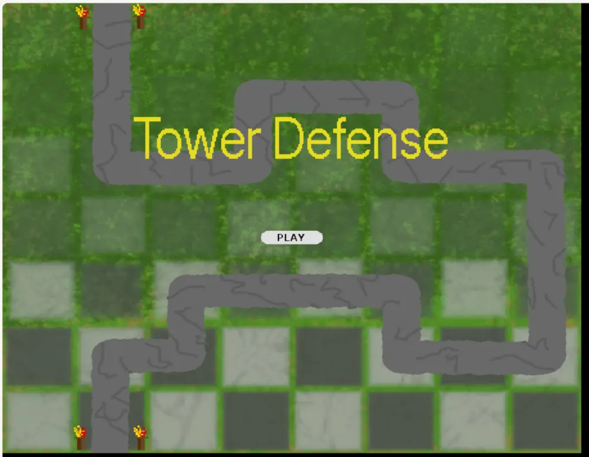

# Tower Defense

A tower-defense game built with Python and Pygame. Place and upgrade different
towers, manage your resources, and defend the path across 13 waves of zombies,
ghosts, and wizards.

## Play in your browser

### [Play Tower Defense](https://danieldavidwang.github.io/Tower-Defense/)

No installation or Replit account is required. The game is compiled for the
browser with [Pygbag](https://pygame-web.github.io/) and deployed automatically
with GitHub Pages.



## Open the project on Replit

### [Open Tower Defense on Replit](https://replit.com/@DanielWang75/Tower-Defense)

The Replit project is the development environment. Its **Run** button opens the
desktop version in a VNC pane. Visitors who want their own editable copy can
select **Remix**. The browser link above is the easiest way to play without
seeing or editing the source code.

## Run locally

Python 3.10 or newer is recommended.

```bash
python3 -m venv .venv
source .venv/bin/activate
python3 -m pip install -r requirements.txt
python3 run.py
```

On Windows, activate the environment with `.venv\\Scripts\\activate` instead.

## How to play

- Select a tower from the sidebar, then click to place it away from the enemy path.
- Use the play/pause button to start or pause a wave.
- Click a placed tower to upgrade or sell it.
- Survive all 13 waves without losing all 10 lives.

## Build the browser version

```bash
python3 -m pip install -r requirements-web.txt
python3 -m pygbag --build --width 900 --height 700 --title "Tower Defense" --ume_block 0 .
python3 -m http.server 8080 --directory build/web
```

Then open `http://localhost:8080`. The browser build is generated in
`build/web` and is not committed to the repository.
